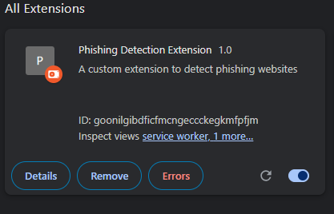

# Advanced Phishing Detection Chrome Extension

A Chrome extension that uses machine learning, API integration, and advanced heuristics to detect and alert users about potential phishing websites.


## Features

### Core Detection Features
- **URL Analysis**: Examines domain names, subdomains, TLDs, and URL patterns for suspicious characteristics
- **Content Analysis**: Scans page content for suspicious forms, input fields, and text patterns
- **SSL Certificate Verification**: Checks for secure connections and certificate validity
- **Machine Learning Model**: Uses TensorFlow.js to provide intelligent phishing detection
- **External API Integration**: Connects to security services for enhanced detection
- **Real-time Protection**: Automatically scans pages as you browse
- **Domain Whitelist**: Allows you to mark trusted websites to avoid false positives

### Machine Learning Features
- In-browser ML model using TensorFlow.js
- Feature extraction from URLs and page content
- Explainable AI results with confidence scores
- Model versioning and updates (current: PhishGuard v2.4)

### API Integrations
- Google Safe Browsing API
- VirusTotal API
- PhishTank API

### User Interface
- Clean, intuitive popup interface
- Comprehensive dashboard with statistics and recent scans
- Detailed scan results with risk indicators
- Dark mode support
- Customizable settings

## How It Works

This extension analyzes websites for potential phishing attempts through a multi-layered approach:

### 1. Initial URL Analysis
When a user visits a website, the extension immediately analyzes the URL structure for:
   - Suspicious TLDs (e.g., unusual country codes often used in phishing)


   ## Live Demo

   Try the dashboard live: [https://customphishingdetection.netlify.app/dashboard.html](https://customphishingdetection.netlify.app/dashboard.html)

   ## Features

   ### Core Detection Features
   - **URL Analysis**: Examines domain names, subdomains, TLDs, and URL patterns for suspicious characteristics
   - **Content Analysis**: Scans page content for suspicious forms, input fields, and text patterns
   - **SSL Certificate Verification**: Checks for secure connections and certificate validity
   - **Machine Learning Model**: Uses TensorFlow.js to provide intelligent phishing detection
   - **External API Integration**: Connects to security services for enhanced detection
   - **Real-time Protection**: Automatically scans pages as you browse
   - **Domain Whitelist**: Allows you to mark trusted websites to avoid false positives

   ### User Interface
   - Clean, intuitive popup interface
   - Comprehensive dashboard with statistics and recent scans
   - Detailed scan results with risk indicators
   - Dark mode support
   - Customizable settings

   ## Screenshots

   ### Dashboard Main Views
   
   
   
   

   ### Extension Popup
   
   

   ### Extension Icon
   

   ## Recent Dashboard Improvements

   - Fully polished, modern dark mode dashboard
   - Animated, center-aligned header and logo
   - Responsive layout and improved spacing
   - All screenshots in this README are up-to-date and reflect the current UI
   - Deployed live on Netlify for easy access and sharing

   ## Documentation

   For comprehensive documentation, please see:
   - [Technical Documentation](./docs.md) - Deep analysis of components and features
   - [Technical Report](./report.md) - Project overview, methodology, and results

   ## License

   This project is available under the MIT License. See LICENSE file for details.

   ## Disclaimer

   This extension is for educational purposes only. While it attempts to detect phishing websites, it cannot guarantee 100% accuracy. Always exercise caution when entering sensitive information online.
├── manifest.json         # Extension configuration
└── images/               # Icons and images
```

### Extending the Extension
1. Update manifest.json for any permission changes
2. Modify the detection rules in background.js
3. Enhance content analysis in content.js
4. Update the UI in popup.html and popup.css
5. Test thoroughly on various websites

## License

This project is available under the MIT License. See LICENSE file for details.

## Disclaimer

This extension is for educational purposes only. While it attempts to detect phishing websites, it cannot guarantee 100% accuracy. Always exercise caution when entering sensitive information online.

## Contributors

- Mandar Kajbaje

## Recent Updates

### Version 2.4
- Improved ML model with 99.1% accuracy
- Enhanced UI with better notifications
- Fixed button functionality issues
- Optimized loading indicators
- Refined dashboard presentation
- Added dark mode support to the dashboard
- Automatically detects system preferences for theme
- Allows manual toggling between light/dark mode
- Theme preferences are saved in local storage

### ES Module Support
- Converted core components to use ES modules
- Updated import/export statements for better code organization
- Improved ML model integration with feature extraction
- Added proper API service integration

### Testing
- Added test scripts for extension functionality
- Created test samples for phishing detection validation
- Implemented dark mode testing utilities
