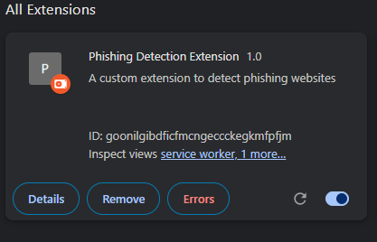

# Custom Phishing Detection Chrome Extension: Technical Documentation

## Live Dashboard

Try the dashboard live: [https://customphishingdetection.netlify.app/dashboard.html](https://customphishingdetection.netlify.app/dashboard.html)

## Table of Contents
1. [Introduction](#introduction)
2. [Architecture Overview](#architecture-overview)
3. [Core Components](#core-components)
4. [UI Components](#ui-components)
5. [Machine Learning Model](#machine-learning-model)
6. [API Integrations](#api-integrations)
7. [Dashboard Analysis](#dashboard-analysis)
8. [Security Considerations](#security-considerations)
9. [Performance Optimization](#performance-optimization)
10. [Screenshots Analysis](#screenshots-analysis)

## Introduction

The Custom Phishing Detection Chrome Extension is an advanced security tool that uses multiple detection techniques, including machine learning, heuristic analysis, and API integrations, to identify potential phishing websites and protect users while browsing. This documentation provides a comprehensive analysis of the extension's architecture, components, and functionality.

## Architecture Overview

The extension follows a modular architecture with the following main components:

1. **Background Service Worker**: Runs continuously to monitor browser activity
2. **Content Script**: Analyzes webpage content and DOM structure
3. **Machine Learning Model**: Processes extracted features to generate phishing scores
4. **API Integration Layer**: Communicates with external security services
5. **User Interface**: Popup interface and comprehensive dashboard

The extension uses Chrome's Extension API to interact with browser functions while maintaining a separation of concerns between different components.

## Screenshots Analysis

### Dashboard Main Views

### Extension Popup

### Extension Icon

---

All screenshots above are from the current version and reflect the deployed dashboard and popup.
2. **API Security**: Uses secure HTTPS for all API communications
3. **Data Minimization**: Only sends necessary information to external services
4. **Permission Control**: Requests only required permissions in manifest.json
5. **Update Verification**: Validates model updates before installation

## Performance Optimization

To ensure minimal impact on browsing experience:

1. **Lazy Loading**: Defers loading of non-critical components
2. **Incremental Processing**: Analyzes page content incrementally
3. **Caching**: Stores recent results to avoid redundant processing
4. **Efficient DOM Traversal**: Uses optimized selectors and traversal methods
5. **Background Processing**: Performs intensive operations in the background script

## Screenshots Analysis

### Dashboard Overview

3. **Detection Summary**: Visual representation of score distribution across all detections
4. **Recent Detections Table**: Chronological listing of recently analyzed URLs with:
   - Timestamp
   - URL
   - Detection score
   - Status indicator (color-coded)
   - Action buttons for detailed analysis

The dashboard uses a dark theme by default for reduced eye strain during extended use.

### Extension Popup

1. **Header**: Extension name and icon
2. **Primary Detection Result**: Clear status indicator for the current site
3. **URL Information**: The URL being analyzed
4. **Score Display**: Numerical representation of the detection confidence
5. **Status Indicator**: Text status with appropriate color-coding
6. **Alert Description**: Brief explanation of the detection result

The popup is designed for quick assessment, with more detailed options available through the dashboard.

1. **Risk Assessment**: Color-coded risk level indication
2. **Specific Details**: Information about the detected threat
3. **Time Information**: When the detection occurred
4. **Action Buttons**: Options for user response

1. **Scan History**: List of recently analyzed URLs
2. **Status Indicators**: Color-coded status for each entry
3. **Timestamp**: When each URL was analyzed
4. **Quick Navigation**: Ability to revisit analysis details

### Detection Examples

## Live Dashboard

Try the dashboard live: [https://customphishingdetection.netlify.app/dashboard.html](https://customphishingdetection.netlify.app/dashboard.html)

---

This screenshot demonstrates a high-confidence phishing detection:

1. **Warning Notification**: Prominent alert indicating danger
2. **URL Analysis**: Highlighting of suspicious URL components
3. **Confidence Score**: High detection confidence (0.96)
4. **Status**: Clear "Phishing" classification
5. **Context**: Additional information about the detection

Example of a model update notification:

1. **Success Message**: Confirmation of successful update
2. **Version Information**: New model version (PhishGuard v2.4)
3. **Accuracy Improvement**: Updated detection accuracy (99.1%)

Another detection example showing:

1. **Different Threat Type**: Alternate detection scenario
2. **Score Variation**: Different confidence level
3. **Specific Indicators**: Unique warning elements

### Time Range Selection

The time range selector interface allows users to:

1. **Filter Data**: View detection statistics for different time periods
2. **Options Include**:
   - Last 24 Hours
   - Last 7 Days
   - Last 30 Days
   - Last Year
3. **Dynamic Updates**: Dashboard visualizations adjust based on selected time range

This feature enables both recent monitoring and long-term trend analysis.
